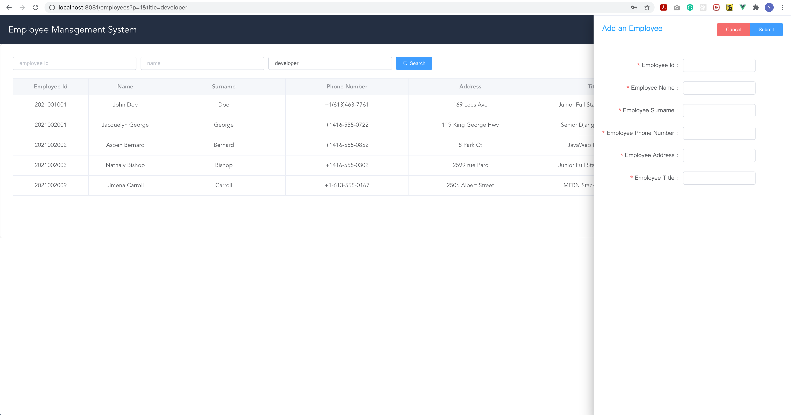
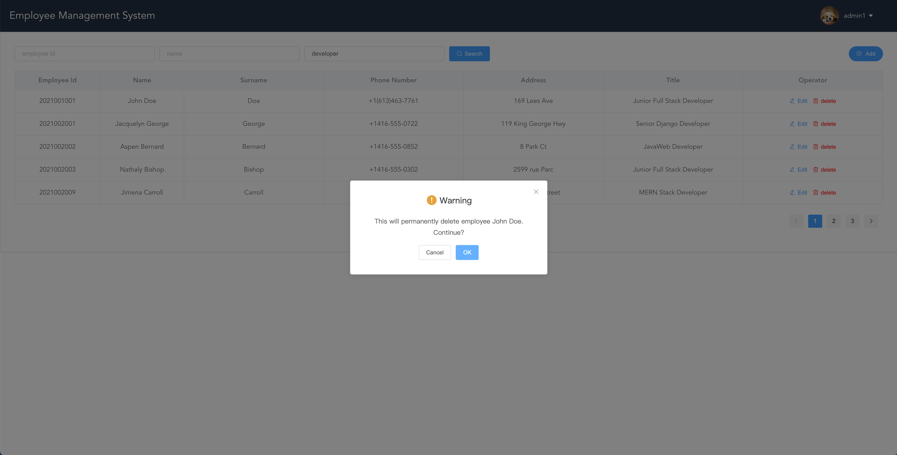
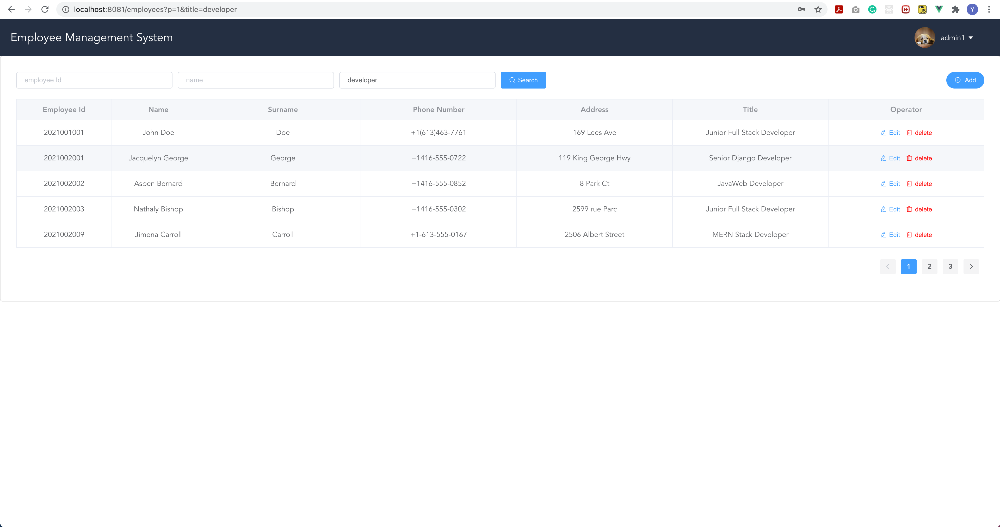
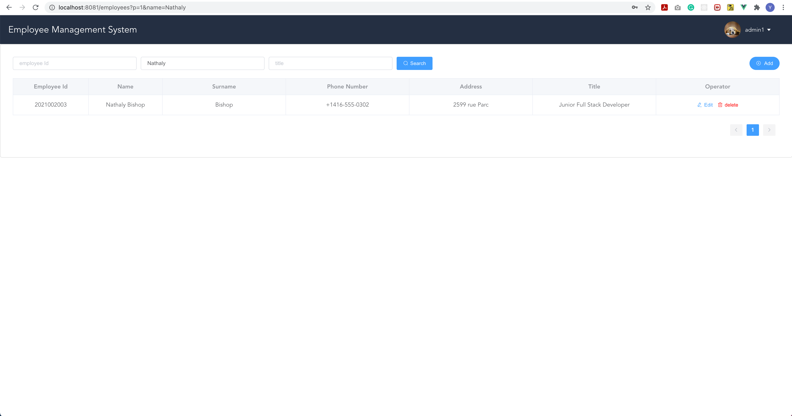
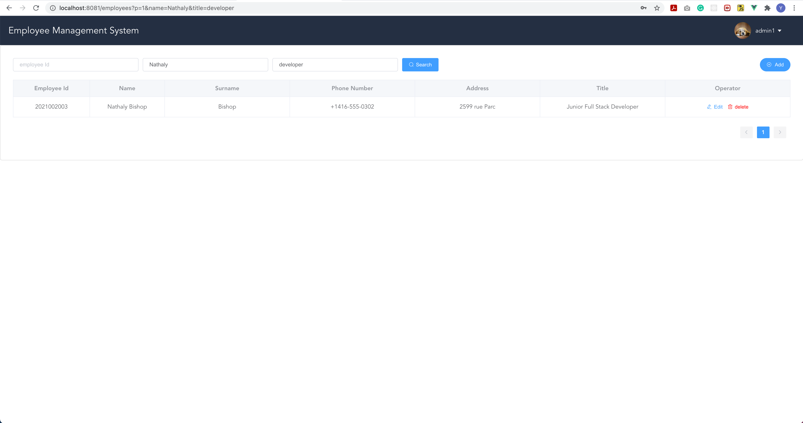
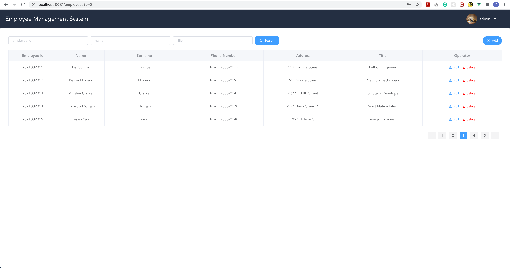
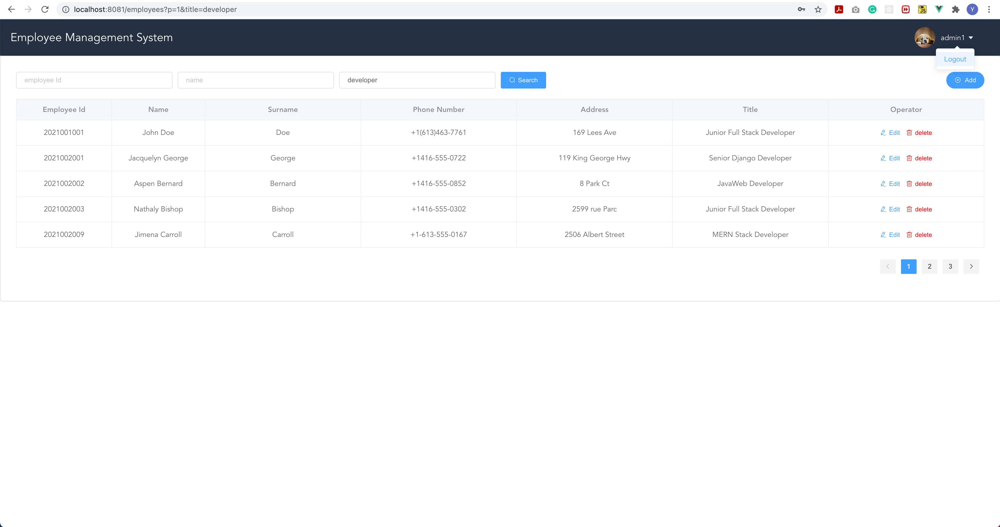

# Employee Management System

> This repository is the frontend service of Employee Management System (EMS)
>
> For backend service, please visit https://github.com/YuKangYin1997/ems-backend

## Features

- Login to system as an administrator
- Add a new employee
- Edit an employee
- Delete an employee
- List and filter employees according to combination of different criteria

## Requirements

- Vue.js 2.6.11

## Backend Service Setup

1. Run `npm install` to install all dependencies

2. Run `npm run serve` to start frontend service at http://localhost:8081

3. Please start backend service before starting frontend service

## Sample

1. login
   

2. add an employee
   

3. edit an employee
   

4. delete an employee
   

5. filter employee by title
   

6. filter employee by name
   

7. filter employee by name and title
   

8. filter employee by page
   

9. logout
   